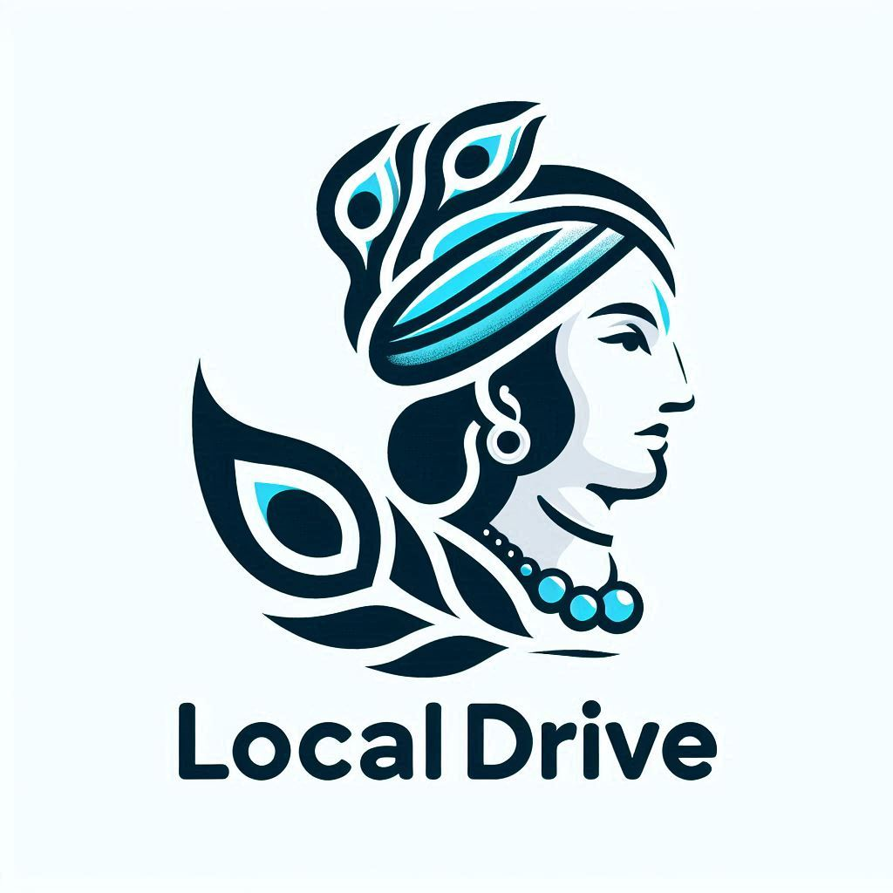

# LocalDrive - Divine Connectivity for File Sharing

  

  <b>Share files across your devices with divine simplicity</b> 
  A Krishna-inspired file sharing application for seamless local network connectivity

  
  
  

## 🌟 Overview

LocalDrive is inspired by Lord Krishna's divine quality of connectivity. Just as Krishna connected with everyone, LocalDrive connects all your devices on the same network. This application provides a simple, elegant, and efficient way to share files between your devices without complicated setup or dependency on cloud services.

With LocalDrive, you can instantly transform any folder on your Windows computer into a local file server that's accessible from any device on your network through a web browser.

## ✨ Key Features

- **Instant Sharing**: Transform any folder into a file server with just one click
- **Cross-Platform Access**: Access files from any device with a web browser (mobile, tablet, another computer)
- **Beautiful Web Interface**: Krishna-inspired design with intuitive controls
- **QR Code Connectivity**: Scan and connect instantly from mobile devices
- **File Management**:
  - Upload files and create folders
  - Delete unwanted files and folders
  - Rename items for better organization
  - View detailed file properties
- **Media Streaming**: Stream videos and other media directly in your browser
- **Windows Integration**:
  - System tray functionality for minimized operation
  - Context menu integration - right-click any folder to share it
  - Start with Windows option
- **Security**: Files are only accessible on your local network, not exposed to the internet

## 🖼️ Demo Video

[Click here to watch the demo video](https://www.youtube.com/watch?v=your_video_id_here) *(Coming soon)*

  
   <i>(Screenshot placeholder - Will be updated soon)</i>

## 📋 Requirements

- Windows 10 or higher (64-bit)
- 100 MB of free disk space
- Local network connection

## 🚀 Installation

### Easy Install Method
1. Download the latest installer from the [releases page](https://github.com/ranjanlive/localDrive/releases)
2. Run the installer and follow the on-screen instructions
3. Launch LocalDrive from the Start Menu or desktop shortcut

### Manual Setup (For Developers)
1. Clone this repository: git clone https://github.com/ranjanlive/localDrive.git
2. Install required dependencies: pip install -r requirements.txt
3. Run the application: python launcher_win.py

## 🎮 How to Use

1. **Start the server**:
- Launch LocalDrive
- Click "Start Server" to begin sharing the current folder, or
- Use Settings to configure auto-start options

2. **Connect from other devices**:
- Scan the QR code with your mobile device, or
- Enter the displayed URL in any web browser on your network

3. **File operations**:
- Browse folders by clicking on them
- Upload files using the upload button
- Create new folders as needed
- Right-click (or long press on mobile) for additional options:
  - Rename files/folders
  - Delete files/folders
  - View file details
  - Preview media files

4. **Context Menu Integration**:
- Right-click any folder in Windows Explorer
- Select "Share with LocalDrive" to instantly share that specific folder

## ⚙️ Advanced Configuration

LocalDrive offers several configuration options in the Settings panel:

- **Server Options**:
  - Auto-start server when application launches
  
- **Windows Integration**:
  - Start with Windows
  - Start minimized to system tray
  - Add 'Share with LocalDrive' to Explorer context menu
  
- **Application Behavior**:
  - Configure exit behavior (ask, minimize, or exit)
  
- **Updates**:
  - Check for updates manually

## 🔧 Technical Details

LocalDrive is built with:
- Python (backend core)
- Flask (web server)
- HTML5, CSS3, and JavaScript (web interface)
- Tkinter (desktop GUI)
- pystray (system tray integration)

The application creates a local web server that serves a responsive interface accessible to any device on the same network. It does not expose your files to the internet, ensuring your data remains private and secure.

## 🛠️ Building from Source

To build the executable yourself:

1. Install Python 3.8 or higher
2. Install all dependencies: `pip install -r requirements.txt`
3. Run the build script: `python build-exe.py`
4. Follow the prompts to create an executable and/or installer

## 📜 License

LocalDrive is free software: you can redistribute it and/or modify it under the terms of the GNU General Public License as published by the Free Software Foundation, either version 3 of the License, or (at your option) any later version.

This program is distributed in the hope that it will be useful, but WITHOUT ANY WARRANTY; without even the implied warranty of MERCHANTABILITY or FITNESS FOR A PARTICULAR PURPOSE. See the GNU General Public License for more details.

You should have received a copy of the GNU General Public License along with this program. If not, see [https://www.gnu.org/licenses/](https://www.gnu.org/licenses/).

## 👨‍💻 Developer

LocalDrive is developed by Ranjan Developer from Bihar, India, with a passion for creating tools that combine spiritual values with practical technology.

- 💌 Email: [contact@example.com](mailto:contact@example.com)
- 🌐 GitHub: [https://github.com/ranjanlive](https://github.com/ranjanlive)
- 🌐 LinkedIn: [LinkedIn Profile](https://www.linkedin.com/in/yourprofile/)
- 💻 Project Repository: [https://github.com/ranjanlive/localDrive](https://github.com/ranjanlive/localDrive)

## 🤝 Contributing

Contributions are welcome! Please feel free to submit a Pull Request.

1. Fork the repository
2. Create your feature branch (`git checkout -b feature/amazing-feature`)
3. Commit your changes (`git commit -m 'Add some amazing feature'`)
4. Push to the branch (`git push origin feature/amazing-feature`)
5. Open a Pull Request

## ❓ FAQ

**Q: Is my data secure when using LocalDrive?**  
A: Yes. LocalDrive only makes your files accessible on your local network. It doesn't expose them to the internet. The application doesn't send any data to external servers.

**Q: Can I access my files from outside my home network?**  
A: LocalDrive is designed for local network use only. If you need remote access, you would need to set up additional networking solutions like a VPN to your home network.

**Q: Does LocalDrive work on networks with multiple subnets?**  
A: By default, LocalDrive binds to all network interfaces (0.0.0.0). However, network routing between subnets might still be required depending on your network configuration.

**Q: Is there a mobile app version?**  
A: Currently, LocalDrive works through a web interface that's fully responsive and works well on mobile browsers. A dedicated mobile app might be developed in the future.

## 🙏 Acknowledgements

- Lord Krishna for divine inspiration
- All open-source libraries and tools that made this project possible
- The wonderful community for support and feedback

श्री कृष्णार्पणमस्तु 🙏

---

Copyright © 2024 Ranjan Developer - GNU GPL v3
